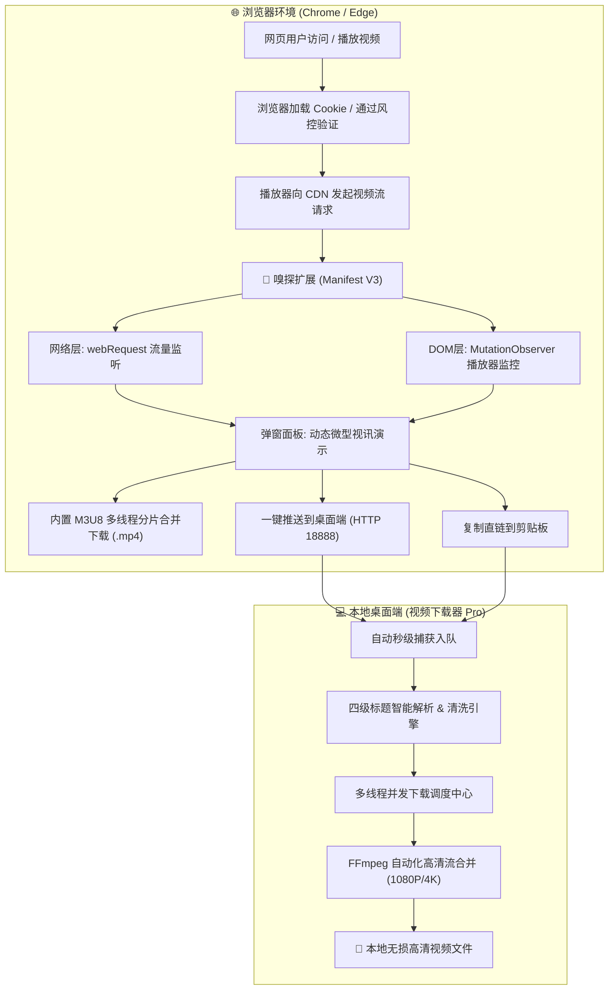

<div align="center">

# 🚀 万能视频下载器 Pro · Universal Video Downloader Pro

<p align="center">
  <strong>现代化全能视频下载套件：桌面级多线程并发下载器 + Chromium / Edge 浏览器流媒体嗅探扩展 (Manifest V3)</strong>
</p>

[](https://www.python.org/)
[](#)
[](#)
[](https://ffmpeg.org/)
[](LICENSE)
[](https://github.com/xulin3344/video-downloader-pro/releases)

<p align="center">
  <a href="#-核心亮点">核心亮点</a> •
  <a href="#-双轨架构设计">架构设计</a> •
  <a href="#-快速上手">快速上手</a> •
  <a href="#-浏览器插件使用指南">浏览器插件</a> •
  <a href="#-特性对比">特性对比</a> •
  <a href="#-常见问题-faq">常见问题</a>
</p>

---

</div>

## 📖 项目简介

在面对**抖音电脑网页版、Bilibili、各类 CMS 影视博客、DPlayer 播放器**等网站时，传统下载工具因遭遇强力动态风控（如 `HTTP 403 Forbidden`、动态 JS 虚拟机挑战、`Fresh cookies needed`）频繁失效。

**万能视频下载器 Pro** 采用创新的**「桌面端高性能下载引擎 + 浏览器内部流量监听嗅探扩展」**双轨协同架构：
1. **桌面端 Pro (GUI)**：基于 Fluent / Catppuccin 质感暗黑主题打造，支持多任务独占进度条、网速显示、系统 FFmpeg 智能级联、剪贴板无感监听与四级标题清洗。
2. **浏览器扩展 (Manifest V3)**：直接驻留于 Chrome / Edge 流量出口“抄水表”，在浏览器播放的同时被动捕获真实解密的 `.mp4` / `.m3u8` 直链，**100% 免疫网站风控防线**，并支持**卡片内微型视讯动态演示**与**纯前端 M3U8 多线程分片合并**！

---

## ✨ 核心亮点

### 🎨 1. 现代化 Fluent 极客级 UI 质感
* **双主题自由切换**：内置深色暗黑（Catppuccin Mocha）与浅色明亮（Latte）双套调色板，告别落后粗糙的原生界面。
* **任务独立卡片系统**：每个下载任务独占**独立进度条、实时下载速度 (MB/s)、已下/总容量、剩余时间 (ETA) 及错误重试按钮**，并发下载互不干扰。
* **原生视频帧封面提取**：自动调用 FFmpeg 抓取视频真实第一帧生成高清缩略图，直观预览视频内容。

### 🛡️ 2. 100% 突破反爬风控（浏览器扩展赋能）
* 面对抖音等平台的滑块验证与动态加密签名，直接在 Chrome / Edge 中正常播放，插件在网络水管旁路被动嗅探。
* 无需破解任何逆向算法，即可拿到已授权的 CDN 高清直链。

### 🎬 3. 独家内嵌微型视讯动态演示
* 浏览器插件弹窗中的每个视频卡片均集成**即时微型视频播放器**，支持在卡片内点播预览画面与声音，肉眼校验是否为所需正片，杜绝下错广告片。

### ⚡ 4. 纯前端 M3U8 多线程切片合并转 MP4
* 浏览器插件内置独立 M3U8 下载器，支持 **4 / 6 / 10 / 16 线程**并发抓取 TS 切片。
* 所有分片在浏览器内存中自动拼装组装，一键直接导出单一 `.mp4` 文件，完全不依赖第三方转码服务。

### 🚀 5. 桌面端与浏览器秒级互通
* **方式 A（本地 HTTP 桥梁）**：插件卡片中点击「推送到桌面端」，已打开的桌面下载器自动唤醒至前台并秒速入队解析。
* **方式 B（智能剪贴板监听）**：点击「复制直链」，桌面端监听器毫秒级自动捕获并生成任务卡片。

### 🏷️ 6. 四级真实标题解析清洗引擎
* **多级兜底策略**：短链还原 (b23.tv, v.douyin.com) $\rightarrow$ 原生元数据提取 $\rightarrow$ 网页 HTML OpenGraph Meta 标签清洗 $\rightarrow$ 文件名即时重命名。
* 彻底清除 `_bilibili`、`- 抖音`、`- 优酷` 等垃圾营销后缀与 Windows 非法字符，杜绝无意义哈希乱码。

### 📥 7. 强大智能的批量多链接下载中心
* **多链接智能感知**：在主界面输入框粘贴整篇文本或多个网址时，系统自动识别并引导进入批量中心。
* **一键全部下载流水线**：提供显眼的「🚀 确认并一键全部下载」按钮，导入后自动并发解析、解析完毕立即自动开始下载，全流程无需人工干预！
* **便捷交互支持**：支持右键菜单、一键从剪贴板读取、实时高亮统计有效链接数量与自动去重过滤。

### 🔄 8. 内置「TS 视频一键无损转 MP4」转换中心
* **极速无损流复制 (Stream Copy)**：基于底层 FFmpeg 高速引擎直接换壳，不重新编码、不消耗 CPU，几百兆视频 1 秒内无损转换！
* **一键自动扫描与批量转换**：一键自动扫描「下载文件夹」或当前目录下的所有 `.ts` 视频，清单式高亮进度展示，支持随时直接打开目标文件夹。
* **双入口便捷访问**：主界面顶部快捷栏与网址输入栏均设有醒目的「🔄 TS转MP4」按钮，随时随地一键唤起。

---

## 🏗️ 双轨架构设计



---

## 🚀 快速上手

### 选项 1：直接运行已编译的 Windows 版（免配置）

1. 进入 [Releases 页面](https://github.com/xulin3344/video-downloader-pro/releases) 下载最新版的 `视频下载器v15_Pro.exe`。
2. 双击即可直接运行，无需安装 Python 环境。
3. （可选）将 `ffmpeg.exe` 放置在与程序同级目录下，或确保系统环境变量中有 FFmpeg，即可自动解锁 1080P/4K 超高清音视频流合并。

---

### 选项 2：从 Python 源码启动

```bash
# 1. 克隆本仓库
git clone https://github.com/xulin3344/video-downloader-pro.git
cd video-downloader-pro

# 2. 安装必要依赖
pip install -r requirements.txt

# 3. 启动主程序
python main.py
# 或者: python 视频下载器v10.py
```

---

## 🧩 浏览器插件使用指南

插件源码位于项目目录下的 [`browser_extension/`](browser_extension/) 文件夹中。

### 1 分钟极速安装（Edge / Chrome 通用）：

1. **进入扩展管理页**：
   * Microsoft Edge：在地址栏输入并回车 `edge://extensions/`
   * Google Chrome：在地址栏输入并回车 `chrome://extensions/`
2. **启用开发者模式**：
   * 勾选页面中的 **「开发人员模式 / 开发者模式」** 开关。
3. **载入插件**：
   * 点击 **「加载解压缩的扩展 / 加载已解压的扩展程序」**。
   * 选择本项目中的 `browser_extension` 文件夹。
4. **日常使用**：
   * 播放任意包含视频的网页，插件图标角标自动显示嗅探到的流媒体数量。
   * 点击图标打开弹窗，可直接**预览播放、直接下载、M3U8 切片合并下载**或**一键推送到桌面下载器**！

---

## 📊 特性对比

| 功能特性 | 传统独立下载器 | 普通浏览器插件 | 万能视频下载器 Pro 套件 |
| :--- | :---: | :---: | :---: |
| **抖音/B站/小红书风控突破** | ❌ 易被 403 拦截 | ⚠️ 需手动到处复制 |  **无感突破，直接秒传** |
| **卡片内微型视讯动态演示** | ❌ 仅显示黑框/无预览 | ⚠️ 少数支持 |  **内置轻量级迷你播放器** |
| **M3U8 浏览器内切片合并** | ❌ 需依赖外部转码器 | ⚠️ 多数只下 .m3u8 文本 |  **并发拉取分片转 MP4** |
| **多任务独立实时网速/进度** | ❌ 仅单进度条混杂 | ❌ 无法多任务排队 |  **每个任务卡片独立独占** |
| **桌面与浏览器无缝联动** | ❌ 割裂使用 | ❌ 割裂使用 |  **HTTP微服务 + 剪贴板秒连** |
| **FFmpeg 智能探测合并** | ⚠️ 需繁琐手动指定 | ❌ 不支持 |  **自动扫描环境与便携路径** |

---

## 🛠️ 项目结构

```text
video-downloader-pro/
├── browser_extension/           # 浏览器流媒体嗅探扩展 (Manifest V3)
│   ├── manifest.json            # 扩展配置文件
│   ├── background.js            # 网络流量拦截与分析后台服务
│   ├── content.js               # DOM 播放器注入监控器
│   ├── popup/                   # Fluent 质感弹窗 (预览、复制、下载)
│   ├── downloader/              # 纯前端 M3U8 多线程分片合并器
│   ├── icons/                   # 16/32/48/128 高清图标集
│   └── 安装与使用说明.md         # 插件专属图文安装手册
├── main.py                      # 统一命令行跨平台入口
├── 视频下载器v10.py              # 桌面端完整源码 (Fluent GUI + 下载引擎)
├── 视频下载器v10.spec            # PyInstaller 独立打包构建脚本
├── requirements.txt             # Python 依赖清单
├── LICENSE                      # MIT 开源许可证
└── README.md                    # 项目核心介绍文档
```

---

## ❓ 常见问题 FAQ

#### Q1：为什么某些网页打开插件后没有立即捕获到视频？
* **答**：现代网页多采用流媒体“懒加载”技术（只有用户点击播放或滑入可视区域时，才真正请求 CDN 数据）。只需在网页中正常点播视频，插件角标便会立刻亮起并显示资源。

#### Q2：M3U8 切片合并会上传我的数据吗？
* **答**：完全不会。切片并发拉取、解密与拼接 100% 在您本地浏览器的内存中运行，直接触发本地文件保存，无任何云端中间件，绝对保护隐私。

#### Q3：桌面端无法下载某些超清 (1080P/4K) 格式？
* **答**：Bilibili、YouTube 等平台的 1080P 以上画质通常采用音频与视频分离储存（DASH 机制），需要 FFmpeg 进行静默合并。请确保电脑已安装 FFmpeg 或将其放置于程序同级目录，程序会自动识别并解锁全清晰度合并。

---

## 📜 开源协议

本项目基于 **[MIT License](LICENSE)** 协议开源。欢迎提交 Issue 与 Pull Request 共同完善！

<div align="center">
  <sub>Made with ❤️ for efficient and seamless video preservation.</sub>
</div>
